## Part 1. Запуск нескольких Docker-контейнеров с использованием Docker Compose

Устанавливаем docker и [добавляем пользователя в группу](https://docs.docker.com/engine/install/linux-postinstall/).

На случай проблем с postgres:
```bash
sudo lsof -i :5432  
sudo kill -9 PID  
```

### 1) Напиши Dockerfile для каждого отдельного микросервиса. В отчете отобрази размер собранных образов любого сервиса различными способами.

На примере session-service покажем разницу в сборке:

**Dockerfile с одним этапом**

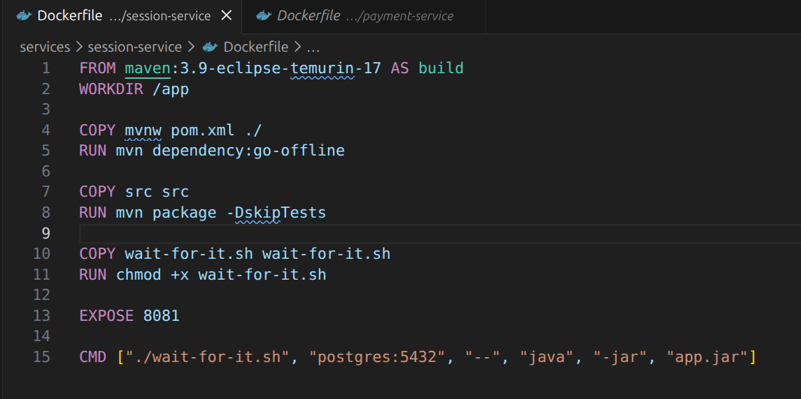

Собираем образ

```bash
docker build -f Dockerfile -t session-service:single .
```

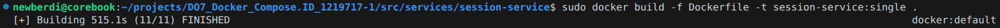

**Dockerfile с несколькими этапами**

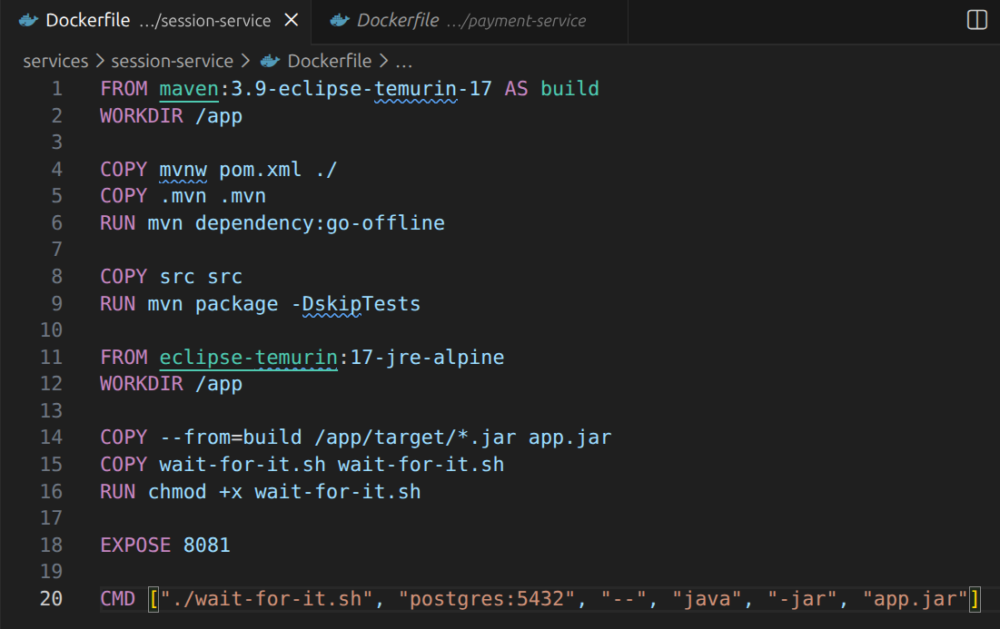

Собираем образ

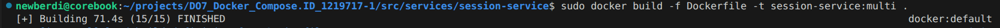

Сравниваем размеры двух образов

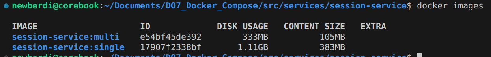

Написаны Dockerfile для всех сервисов

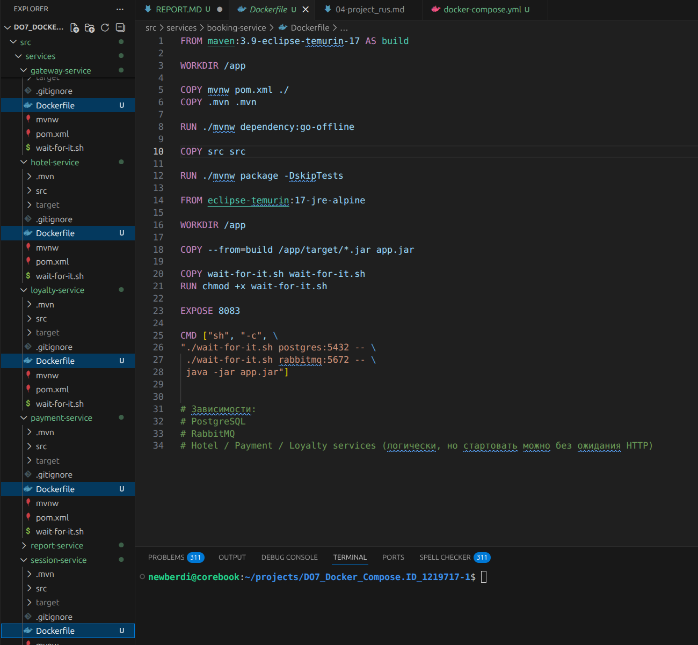

> **Разница между CMD и ENTRYPOINT**:
> - ENTRYPOINT — все аргументы командной строки добавляются к самой инструкции (`docker run` + args).
> - CMD — аргументы командной строки заменят инструкции в CMD.
> - Рекомендуется использовать их вместе (exec + args).
> - `CMD ["sh", "-c", "..."]` — позволяет shell-парсинг: последовательный запуск программ с условным ожиданием.

**Пояснение к wait-for-it.sh:**
В самом коде указано ожидание порта в 15 сек, `-t` можно задавать как аргумент.
Для Docker Compose часто используют именно:
```bash
./wait-for-it.sh postgres:5432 -t 0 -- \
java -jar app.jar
```
чтобы приложение гарантированно не стартовало до готовности PostgreSQL, даже если база поднимается минуту или больше.

### 2) Напиши Docker Compose файл, который осуществляет корректное взаимодействие сервисов. Пробрось порты для доступа к gateway service и session service из локальной машины.

*docker-compose.yml и сервисные dockerfile сначала писались с учетом wait-for-it.sh, но в итоге остался вариант с healthcheck и depends_on, управление вынесено на уровень Docker Compose, что позволило убрать wait-for-it.sh, уменьшить образ и привести архитектуру в соответствие с best practices.*

#### Старый вариант [docker-compose.yml](old/docker-compose01.yml)

`curl` команды:

- `curl -f http:______`:
    - *Успех (healthy)*: если `curl -f` получает HTTP-статус `2xx` или `3xx` (например, `200 OK`, `204 No Content`, `304 Not Modified`).
    - *Неудача (unhealthy)*: если сервер не отвечает, соединение отвергнуто, таймаут или возвращён статус `4xx/5xx`.

- `curl -s -o /dev/null -w "%{http_code}" http:______ | grep -E "^(2|3|4)"`:
    - `-s` (silent) — не выводить прогресс-бар и статистику.
    - `-o /dev/null` — выбросить тело ответа (не нужен сам контент).
    - `-w "%{http_code}"` (write-out) — вывести только HTTP-статус код (например, `200`, `404`, `500`).
    - `| grep -E "^(2|3|4)"` — фильтрует статус-код, оставляя только начинающиеся с `2`, `3` или `4`.

### 3) Собери и разверни веб-сервис с помощью написанного Docker Compose файла на локальной машине.

Полезные команды

```bash
docker stop $(docker ps -aq)
docker volume rm $(docker volume ls -q)
docker network prune -f
docker compose down -v --rmi all --remove-orphans
docker compose down -v
docker system prune -f
docker-compose up --build
```

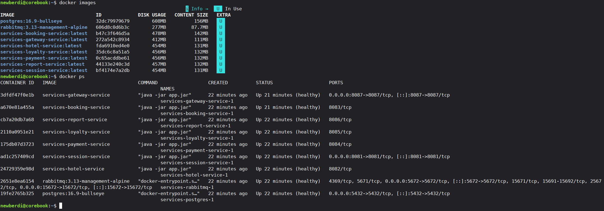

### 4) Прогони заготовленные тесты через postman.

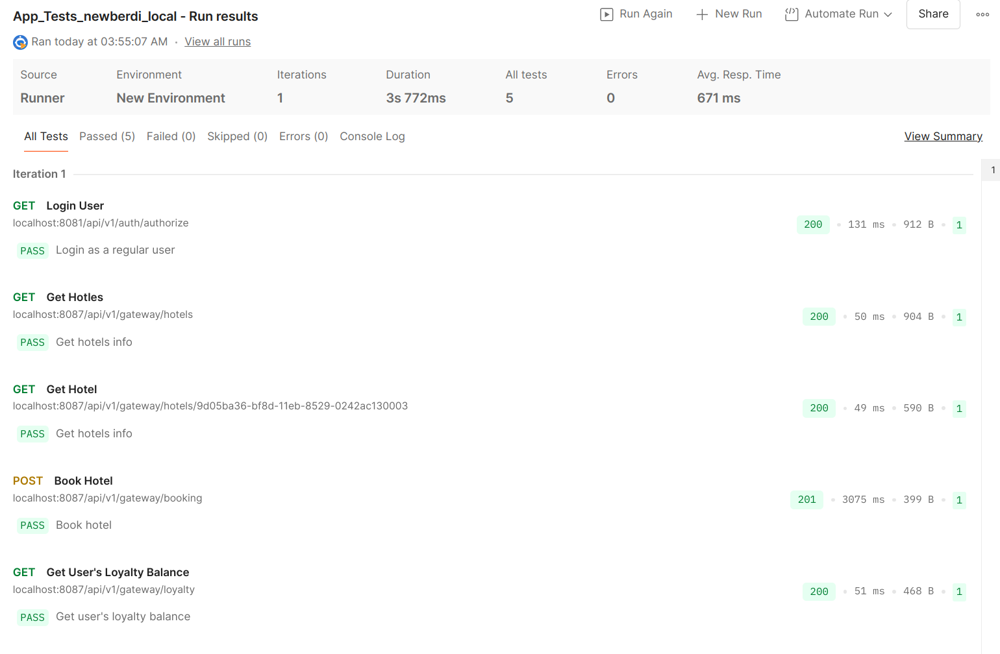

## Part 2. Создание виртуальных машин

### 1) Установи и инициализируй Vagrant в корне проекта.

Также нужен VirtualBox.
```bash
wget -O - https://apt.releases.hashicorp.com/gpg | sudo gpg --dearmor -o /usr/share/keyrings/hashicorp-archive-keyring.gpg
echo "deb [arch=$(dpkg --print-architecture) signed-by=/usr/share/keyrings/hashicorp-archive-keyring.gpg] https://apt.releases.hashicorp.com $(grep -oP '(?<=UBUNTU_CODENAME=).*' /etc/os-release || lsb_release -cs) main" | sudo tee /etc/apt/sources.list.d/hashicorp.list
sudo apt update && sudo apt install vagrant

vagrant --version
VBoxManage --version
```

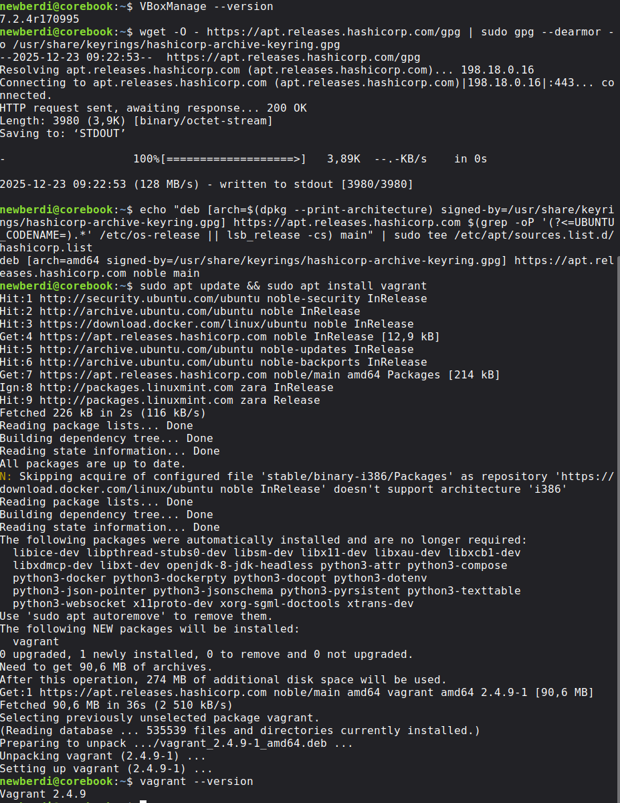

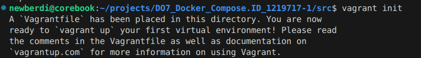

Напиши Vagrantfile для одной виртуальной машины. Перенеси исходный код веб-сервиса в рабочую директорию виртуальной машины.

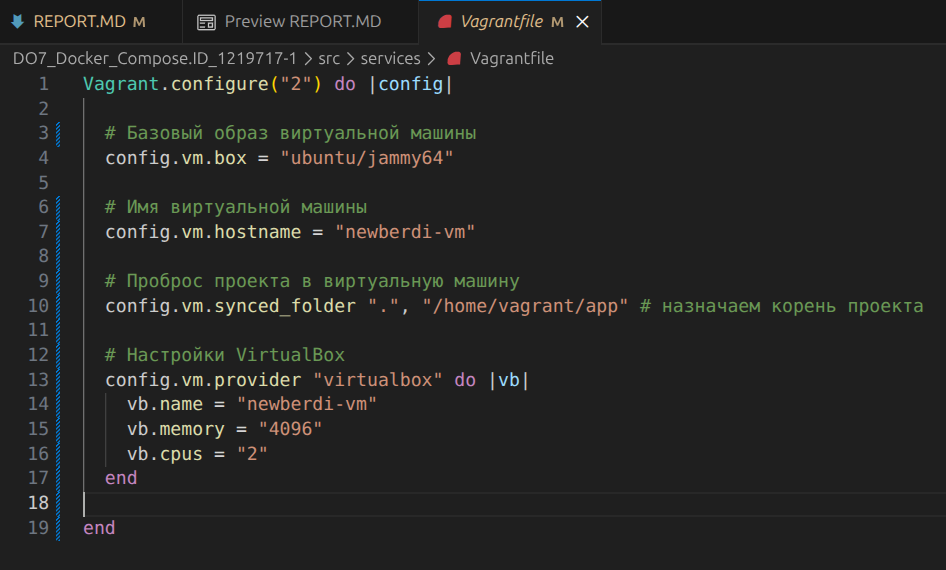

Запускаем виртуальную машину

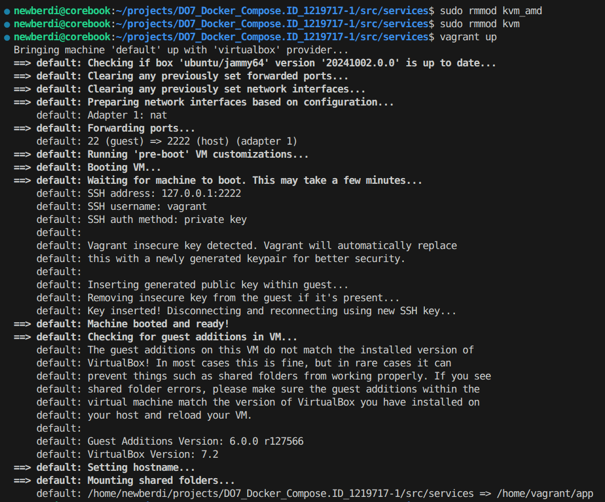

Иногда требуется установка плагина vbguest с помощью команды: `vagrant plugin install vagrant-vbguest`.

Если добавить строчку `config.vm.synced_folder ".", "/app"` в vagrantfile, синхронизация произойдет в указанную папку, а не в папку по умолчанию (/vagrant).

Есть и другие механизмы:

- **Synced Folder с rsync** (файлы копируются один раз при `vagrant up`, далее — по команде `vagrant rsync`):
    ```ruby
    config.vm.synced_folder ".", "/home/vagrant/app", type: "rsync"
    ```

- **Provisioning** (файлы копируются однократно при создании ВМ):
    ```ruby
    config.vm.provision "file", source: ".", destination: "/home/vagrant/app"
    ```

- **Provisioning через Git** (pull внутри ВМ):
    ```ruby
    config.vm.provision "shell", inline: <<-SHELL
      sudo apt update
      sudo apt install -y git
      git clone https://github.com/user/repo.git /home/vagrant/app
    SHELL
    ```

### 2) Зайди через консоль внутрь виртуальной машины


и удостоверься, что исходный код встал, куда нужно.

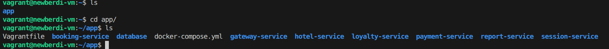

Останови и уничтожь виртуальную машину.

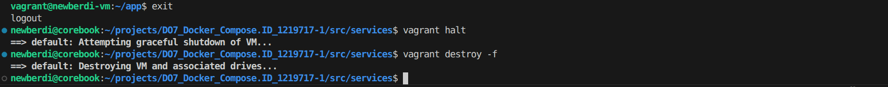

## Part 3. Создание простейшего Docker Swarm

### 1) Модифицируй Vagrantfile для создания трех машин: manager01, worker01, worker02.

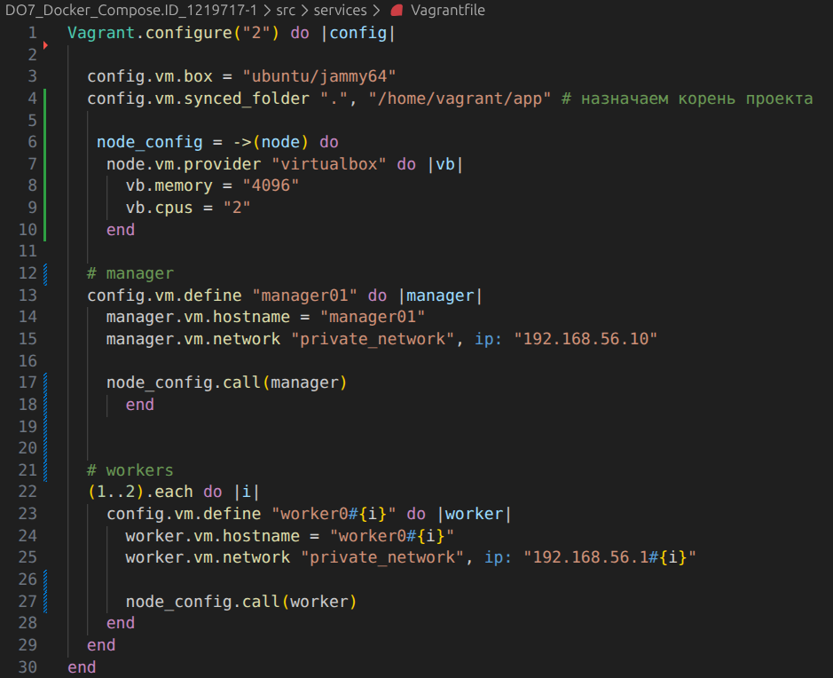

Важно! Указать конечную папку для synced_folder, иначе вылезают проблемы с авторизацией по private_key  

### 2) Напиши shell-скрипты для установки Docker внутрь машин, инициализации и подключения к Docker Swarm.

Скрипт для установки Docker и сервисов

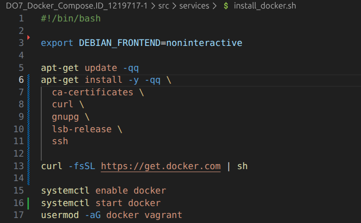

Добавляем в Vagrantfile:

скрипт для инициализации Docker Swarm и порт-форвардинг для менеджера

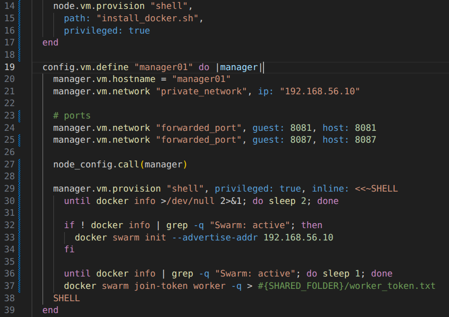

скрипт для подключения к Docker Swarm воркеров

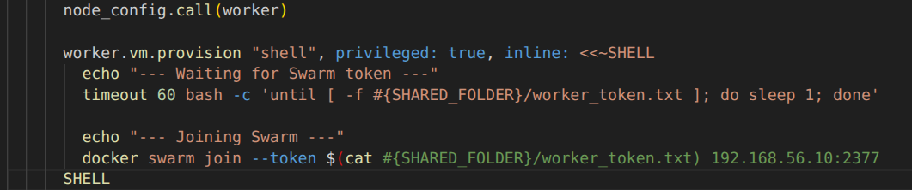

### 3) Загрузи собранные образы на Docker Hub

Тегаем каждый сервис и пушим на Docker Hub

```bash
docker login
docker tag services-booking-service:latest user/repo:name-service-ver
docker push user/repo:name-service-ver
```

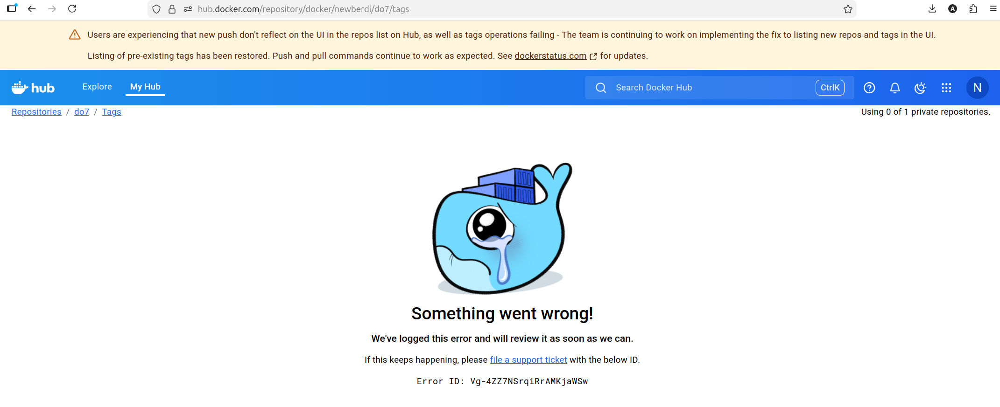

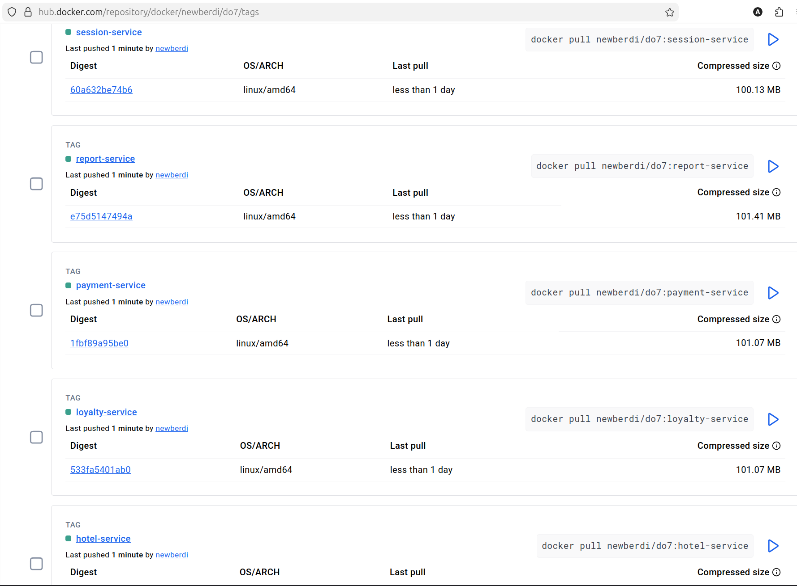

и модифицируй Docker Compose файл для подгрузки расположенных на Docker Hub образов.

#### Новый [docker-compose.yml](old/docker-compose02.yml)

> *bridge: работает только на одной машине, подходит для `docker compose up`, не работает в Swarm.*  
> *Docker Swarm требует overlay-сеть: overlay создаёт виртуальную сеть поверх всех нод.*  
> *Swarm сам управляет именами контейнеров, поэтому `container_name` не нужны.*  
> *`depends_on` не работает в Swarm. Swarm не гарантирует порядок старта, сервисы должны быть resilient, Spring Boot сам переподключается к БД/очереди.*  
> *В Swarm ports = ingress, публикуется на весь кластер. Ingress — это встроенная overlay-сеть (ingress), обеспечивающая маршрутизацию внешнего трафика к сервисам через Routing Mesh.*  
> *`attachable: true` — делает сеть доступной для подключения внешних контейнеров и для подключения вручную для отладки.*  

### 4) Подними виртуальные машины и перенеси на менеджер Docker Compose файл. Запусти стек сервисов, используя написанный Docker Compose файл.

Поднимаем виртуальные машины

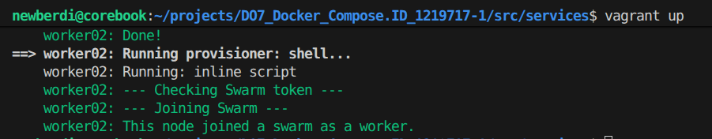

Проверяем через `vagrant status` и/или `docker node ls`

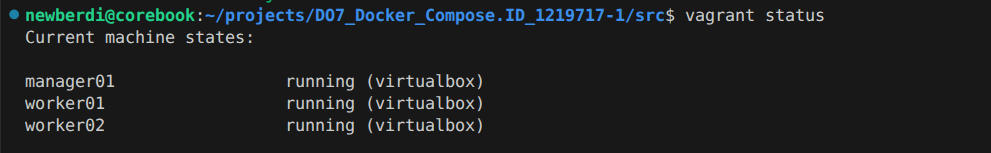

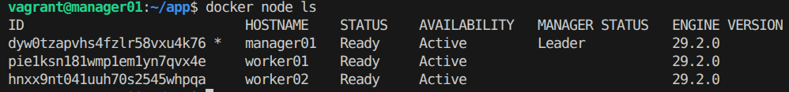

Запускаем стек сервисов, используя написанный Docker Compose файл

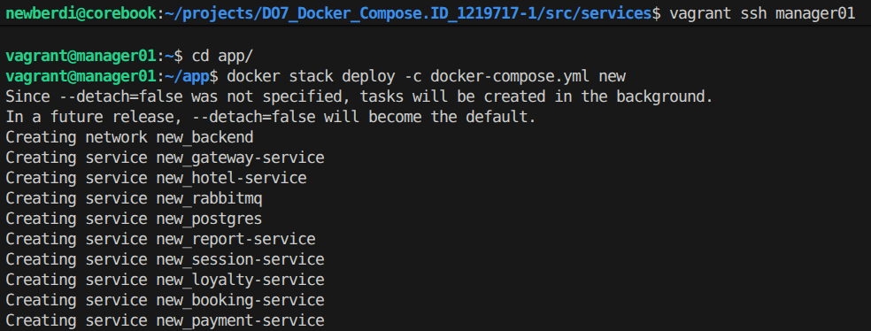

Смотрим результат

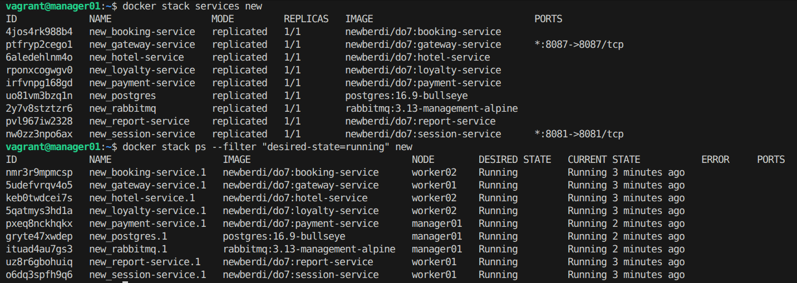

Полезные команды:

```bash
docker stack deploy -c docker-compose.yml new
docker stack services new
docker stack ps --filter "desired-state=running" new
docker stack rm new
docker service logs -f booking_service # просмотр логов отдельного сервиса
docker network ls
docker volume ls
docker rm -vf $(docker ps -aq)
docker service rm $(docker service ls -q)
docker rmi -f $(docker images -aq)
docker system prune -a
```

Тестим работоспособность

в браузере

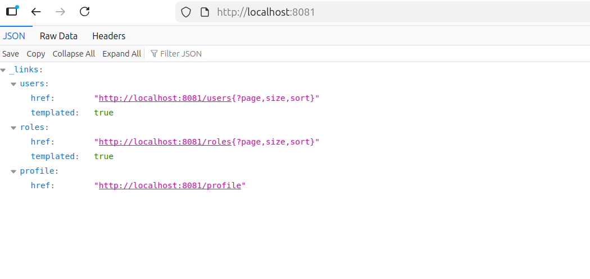

Postman

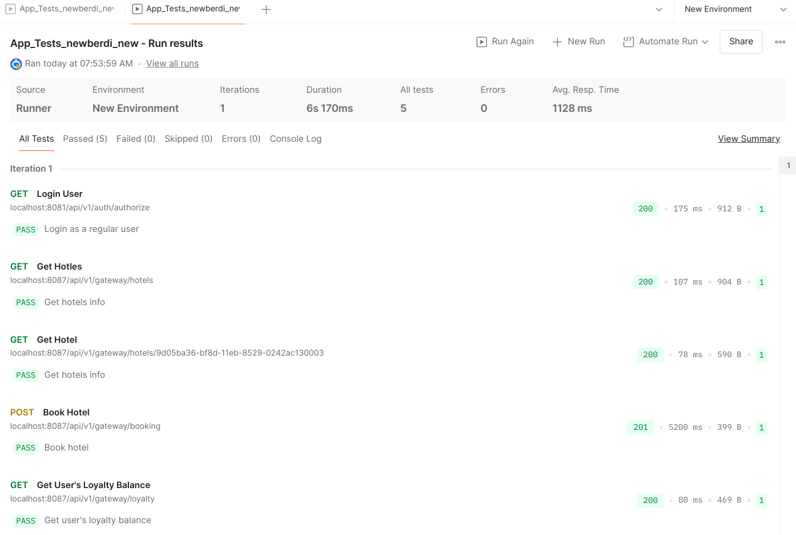

### 5) Настрой прокси на базе nginx для доступа к gateway service и session service по оверлейной сети. Сами gateway service и session service сделай недоступными напрямую.

Создаем nginx.conf файл с настройками прокси

Важно! Нужно при деплое указывать то же самое имя сервиса:
docker stack deploy -c docker-compose.yml **proxy**

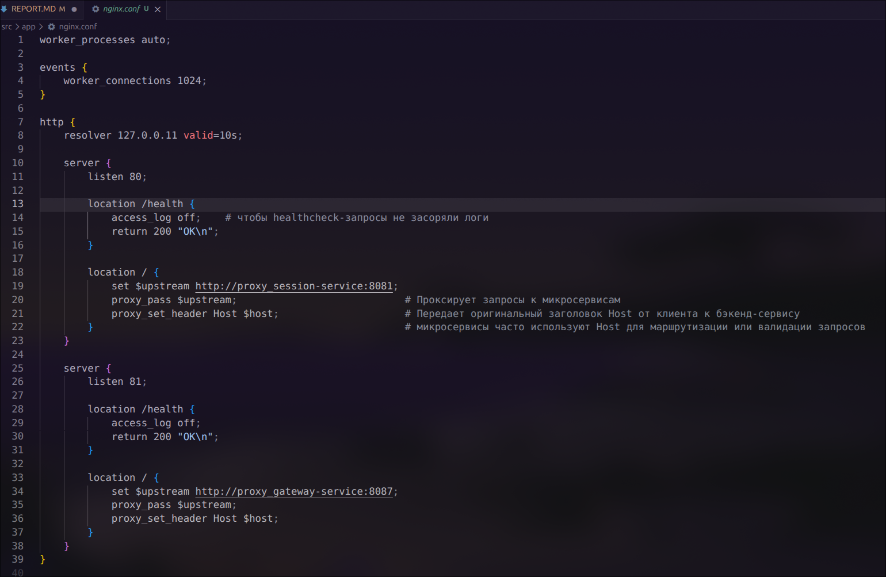

*DNS Docker автоматически связывает IP с именами контейнеров, сервисы в одной сети видят друг друга по имени*

> - `worker_processes auto` — 1 рабочий процесс Nginx = 1 CPU ядро.
> - `worker_connections` — максимальное количество одновременных соединений на один рабочий процесс.
> - `resolver 127.0.0.11` — Docker DNS-резолвер для преобразования имён хостов в IP-адреса.
> - `server {` — объявление виртуального сервера.
> - `listen 80;` — сервер слушает порт 80 внутри контейнера nginx.
> - `location / {` — правило для всех запросов (`/` означает "любой путь").
> - Для дополнительной информации можно добавить:
> - `proxy_set_header X-Real-IP` — передает реальный IP клиента для логирования.
> - `proxy_add_x_forwarded_for` — cоздает цепочку IP-адресов, через которые прошел запрос.

Добавляем сервис для nginx в Docker Compose файл

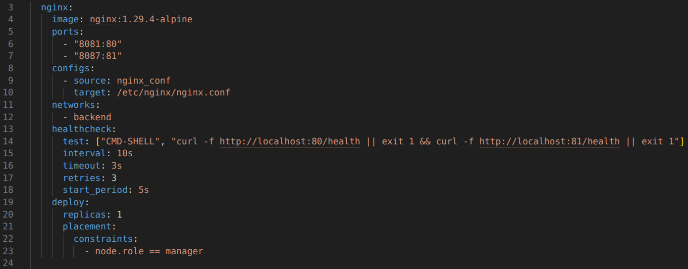

Запускаем стэк сервисов

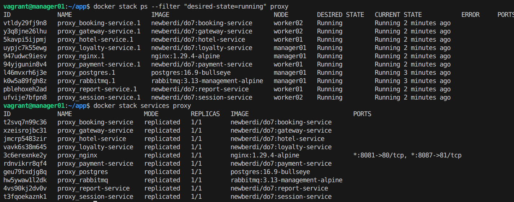

### 6) Прогони заготовленные тесты через Postman и удостоверься, что все они проходят успешно.

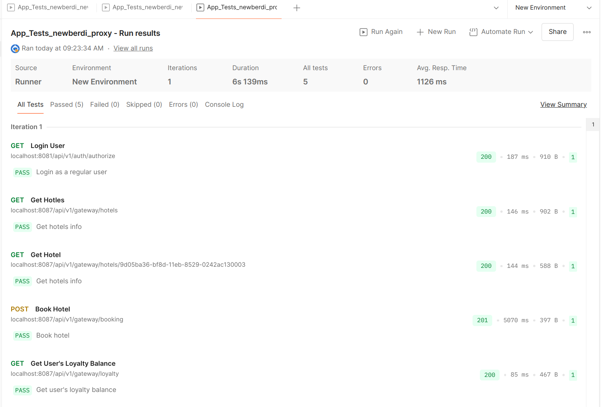

### 7) Используя команды Docker, отобрази в отчете распределение контейнеров по узлам.

```bash
docker node ps <node name> --filter "desired-state=running"
```

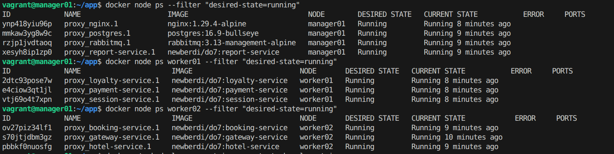

### 8) Установи отдельным стеком Portainer внутри кластера. В отчете отобрази визуализацию распределения задач по узлам с помощью Portainer.

*Стек Portainer состоит из сервиса portainer-agent, развернутого в режиме global на всех узлах кластера, и сервиса portainer, развернутого в одном экземпляре на manager-узле. Агенты обеспечивают сбор информации о состоянии Docker Engine на каждом узле, а сервер Portainer предоставляет веб-интерфейс для визуального управления кластером Docker Swarm.*

Из [официальной документации](https://docs.portainer.io/start/install-ce/server/swarm/linux) Portainer:

Командой на manager01 скачиваем нужный .yml и запускаем сервисы Portainer в стэк:

```bash
curl -L https://downloads.portainer.io/ce-lts/portainer-agent-stack.yml -o portainer-agent-stack.yml
```

Остается только отредактировать порт (если нужно) и для корректного доступа с локальной машины добавляем порт-форвардинг в Vagrantfile:

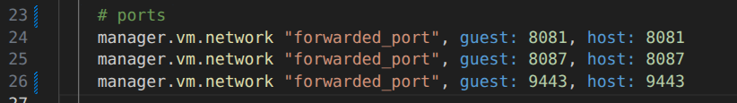

Запускаем сервисы portainer

```bash
docker stack deploy -c portainer-agent-stack.yml portainer
```

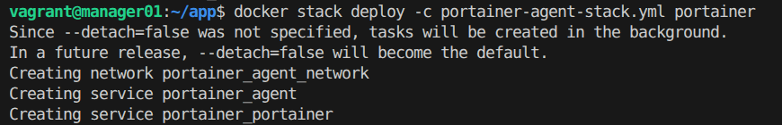

Через `https://localhost:9443` заходим на сайт, где нужно задать логин и пароль для авторизации

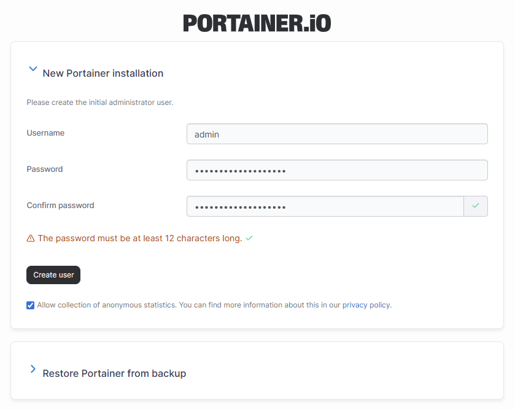

агент подтягивает окружение автоматически

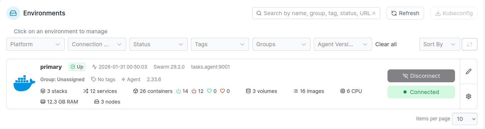

Дашборд с общей информацией

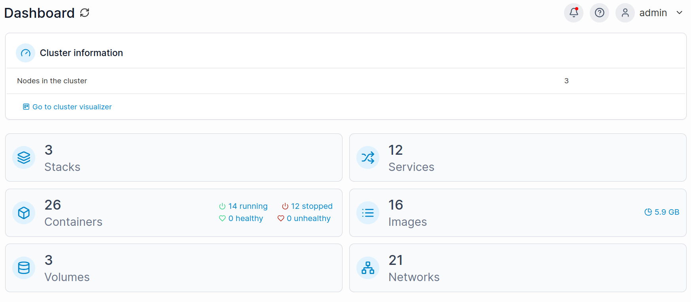

Визуализированное распределение сервисов по нодам

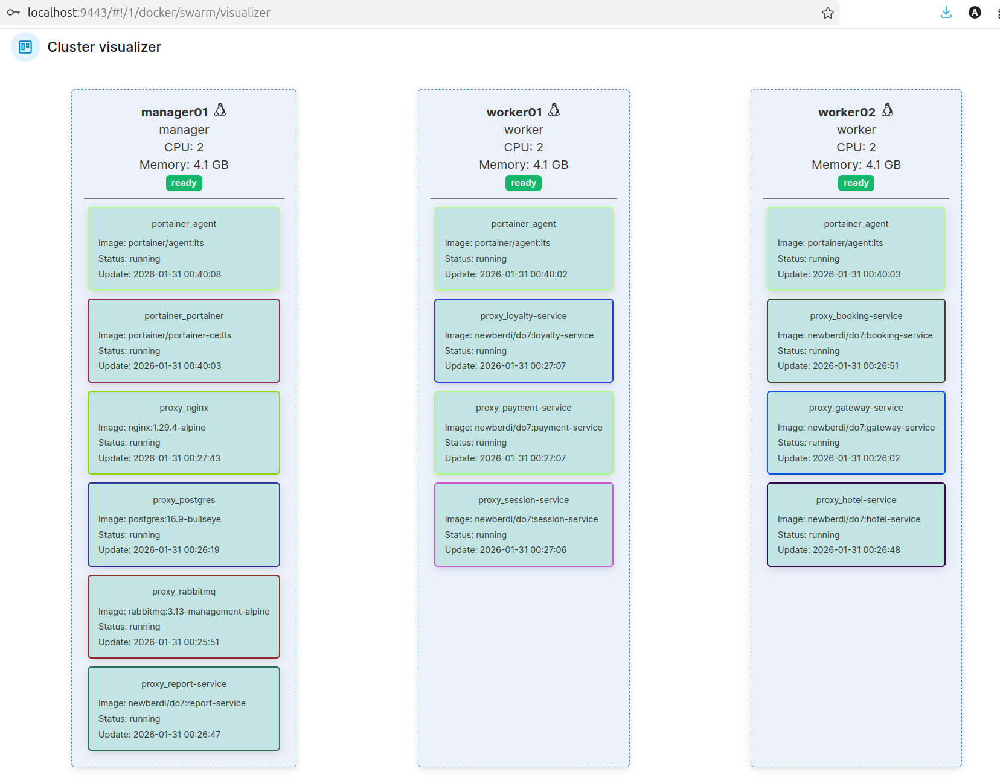